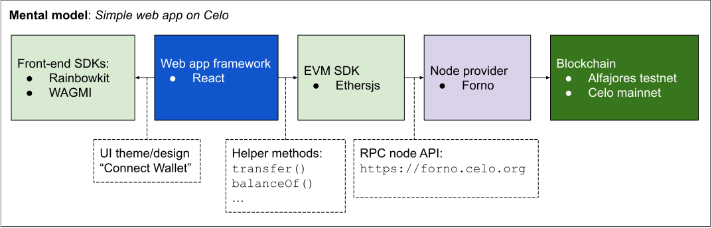

# Welcome to Celo Camp 👋

Whether you are an existing web3 developer or completely new to Celo, we hope this short guide 
will help you decide what developer tools to use during Celo Camp.

## Technical Questions 💬

If you have technical questions during Celo Camp, we recommend you start a 
[Github Discussion](https://github.com/celo-org/celo-camp/discussions) 
in this repository.

Please try to provide as much context as possible including code snippets or links to public 
repositories where possible. A member of Celo's developer relations team or someone from 
the community will respond with guidance or next steps.

Alternatively, you can refer to Celo's public [Discord server](http://chat.celo.org/).

| Communication channel | Average response time | Expectation |
|-----------------------|-----------------------|-------------|
| [Github Discussion](https://github.com/celo-org/celo-camp/discussions) (recommended✨) | 1-2 days | Long-form (possibly) higher quality responses |
| [Celo Discord](http://chat.celo.org/) | <1 day | Short-form (possibly) lower quality responses |

## TLDR

Here is a simplified mental model to think about web applications on Celo.



If you'd like to learn more, visit [Web2 to Web3 - The Anatomy of a dApp][anatomy of a dapp].

## Comparison

| EVM SDKs  | Celo | other EVMs | Language | Description |
|----------|----------|------|-------|--------|
| [Ethers](https://docs.ethers.org/) (recommended✨) | ✅ | ✅ | JavaScript/Typescript |  Popular client library maintained by [ricmoo](https://github.com/ricmoo) |
| [web3.js](https://web3js.readthedocs.io/) | ✅ | ✅ | JavaScript/Typescript | |
| [contractkit](https://docs.celo.org/developer/contractkit) | ✅ | ❌ | JavaScript/Typescript | Specialized Celo library maintained by [cLabs](https://clabs.co/) |

|  Front-end SDKs  | Celo | other EVMs | Framework | Description |
|----------|----------|------|-------|--------|
| [Rainbowkit](https://github.com/celo-org/rainbowkit-celo) (recommended✨) | ✅ | ✅ | React | Popular front-end library maintained by [Rainbow Wallet](https://rainbow.me/) |
| [web3-react](https://github.com/Uniswap/web3-react) | ✅ | ✅ | React | Front-end library maintained by [Uniswap](https://uniswap.org/) |
| [react-celo](https://github.com/celo-org/react-celo) | ✅ | ❌ | React | Specialized Celo library maintained by  [cLabs](https://clabs.co/) |

Learn more about web3 front-ends in [Example architectures for a simple payment dapp][example app].

|  Node provider  | Celo | other EVMs | Description |
|----------|----------|------|--------|
| [Forno](https://docs.celo.org/network/node/forno#forno-networks) (recommended✨) | ✅ | ❌ | Free RPC API on Celo maintained by [cLabs](https://clabs.co/) |
| [Infura](https://www.infura.io/) | ✅ | ✅ | Paid multi-chain RPC API maintained by [Consensys](https://consensys.net/) |
| [Quicknode](https://www.quicknode.com/chains/celo) | ✅ | ✅ | Paid multi-chain RPC API maintained by [Quicknode](https://www.quicknode.com/chains/celo) |
| [Tatum](https://pages.tatum.io/celo) | ✅ | ✅ | Paid multi-chain RPC API maintained by [Tatum](https://pages.tatum.io/celo) |
| [Ankr](https://www.ankr.com/protocol/public/celo/) | ✅ | ✅ | Paid multi-chain RPC API maintained by [Ankr](https://www.ankr.com/protocol/public/celo/) |
| [Figment](https://www.figment.io/datahub/celo) | ✅ | ✅ | Paid multi-chain RPC API maintained by [Figment](https://www.figment.io/datahub/celo) |

Get started using Forno with the [following endpoints](https://docs.celo.org/integration/general#forno):

```zsh
Alfajores = 'https://alfajores-forno.celo-testnet.org'

Mainnet = 'https://forno.celo.org'
```

|  Blockchain  | Description |
|--------------|-------------|
| [Alfajores](https://docs.celo.org/network/alfajores) (recommended✨) | Celo's test network for developers to test their applications. |
| [Mainnet](https://docs.celo.org/network/mainnet)| Celo's production network |

Get testnet tokens at [faucet.celo.org](https://faucet.celo.org/) to start building on Alfajores. 

<!-- References -->
[anatomy of a dapp]: https://docs.celo.org/general/web2-to-web3
[example app]: https://docs.celo.org/blog/tutorials/example-architectures-for-a-simple-payment-dapp
